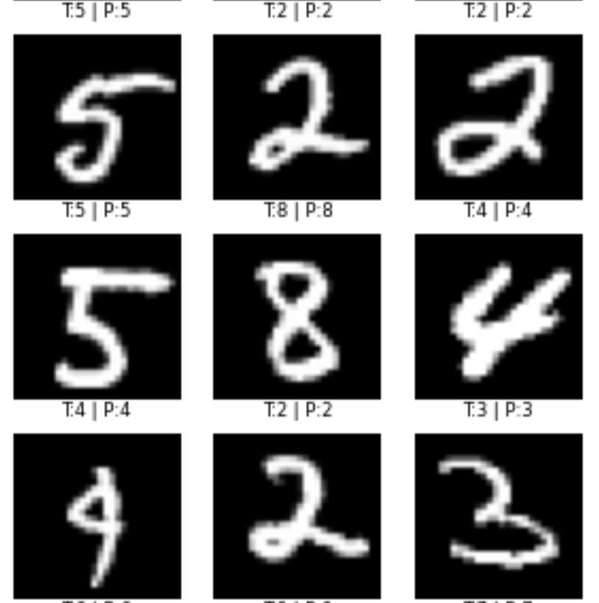

# AI/ML Engineering Portfolio

A comprehensive collection of Jupyter notebooks demonstrating key concepts and practical implementations in Artificial Intelligence and Machine Learning. This portfolio showcases hands-on experience with PyTorch and Keras frameworks, covering fundamental concepts to advanced techniques including deep learning, reinforcement learning, and transformer architectures.

## Project Structure

### `PyTorch/`
| Notebook | Description | Screenshot |
|----------|-------------|------------|
| `BasicTensorExamples.ipynb` | Introduction to PyTorch tensors, data types, and basic operations | |
| `HandwritingClassifier.ipynb` | Multi-class neural network with MNIST to classify hand-written digits using cross entropy function as the criterion for loss |  |

### `Keras/`
| Notebook | Description | Screenshot |
|----------|-------------|------------|
| `TextDataHandling.ipynb` | Text preprocessing with TensorFlow TextVectorization layer | |
| `TimeSeriesPrediction.ipynb` | Advanced transformer-based time series forecasting | |
| `CancerClassification.ipynb` | Deep learning model for breast cancer classification using histopathological images |  |
| `CustomTrainingLoopExample.ipynb` | Implementation of custom training loops with callbacks | |
| `HyperparameterTuningWithKerasTunerExample.ipynb` | Automated hyperparameter optimization using Keras Tuner | |
| `ModelOptimizationTechniques.ipynb` | Model optimization and performance enhancement strategies | |
| `RNN_For_TimeSeries_Predictions.ipynb` | Recurrent Neural Networks for time series forecasting | |
| `OpenAIGymRLExample.ipynb` | Deep Q-Network (DQN) implementation with CartPole environment | |

## Key Concepts Covered

### PyTorch
- Tensor creation and manipulation
- Data type management and conversion
- Basic tensor operations and indexing
- **Handwriting Classification**: Multi-class neural network for MNIST digit recognition using cross-entropy loss

### Keras Deep Learning
- **Advanced Transformers**: Text vectorization, sequence processing, time series prediction
- **Medical Image Classification**: Breast cancer classification using histopathological images
- **Custom Training**: Manual training loops, custom callbacks, metric monitoring
- **Model Optimization**: Hyperparameter tuning, performance optimization techniques
- **RNNs**: Recurrent neural networks for sequential data processing

### Reinforcement Learning
- Deep Q-Network (DQN) architecture
- OpenAI Gymnasium environment integration
- Experience replay and target network implementation
- Exploration vs exploitation strategies

## Getting Started

Each notebook is self-contained with installation instructions and can be run independently. The notebooks include:
- Environment setup and dependency installation
- Step-by-step implementation explanations
- Practical examples with real datasets
- Performance monitoring and visualization

## License

This project is licensed under the MIT License - see the [LICENSE](LICENSE) file for details.
